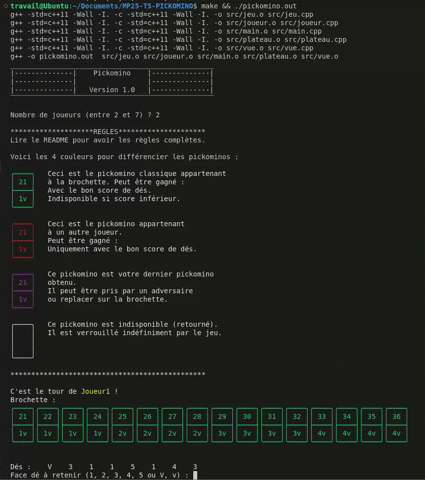

# Mini-projet : Pickomino

- [Mini-projet : Pickomino](#mini-projet--pickomino)
  - [Présentation](#présentation)
  - [Utilisation](#utilisation)
  - [Changelog](#changelog)
  - [TODO](#todo)
  - [Planification des versions](#planification-des-versions)
  - [Défauts constatés non corrigés](#défauts-constatés-non-corrigés)
  - [Équipe de développement](#équipe-de-développement)

---

## Présentation

Le jeu "Pickomino" est assez simple : Avoir le plus de vers à la fin de la partie.

Le jeu se compose de :

- 2 à 7 joueurs.
- 8 🎲 (numéroté de 1 à 5, le 6 est remplacé par un 🪱 qui vaut aussi 5).
- Une brochette de 16 pickominos (numérotée de 21 à 36 et d'un nombre de ver).
- Chaque joueur à une pile (vide au début)

Les règles sont les suivantes :

- A chaque lancé, le joueur retient tous les 🎲 correspondant à la valeur choisie (🪱 compris) et ne peut le resélectionner par la suite.
- Additionner tous les 🎲 retenus et faire un score égal à celui d'un des pickominos pour le récupérer (sur la brochette et sur le piles des joueurs).
- Doit avoir au moins 1 🪱 dans ses 🎲 sinon le tour est nul.
- Si lors du retirage des 🎲, tous les 🎲 ont une valeur déjà retenue alors le tour est nul.
- Quand le joueur gagne un pickomino, il le place en haut de sa pile (il est dit visible).
- Seul les pickominos visibles ont la possibilité de se faire récupérer ou voler (becquetage).
- Si aucun pickomino n'est disponible, le joueur prend le prochain pickomino disponible de valeur inférieure (uniquement sur la brochette).
- Si aucun pickomino n'est disponible alors le tour est nul.
- Si le tour est nul, le joueur remet son dernier pickomino dans la brochette.
- Si le pickomino remis par le joueur n'est pas le pickomino avec la valeur la plus élevée alors le pickomino avec la valeur la plus élevée de la brochette est retourné face caché et devient irrécupérable.
- La partie prend fin dès qu’il ne reste plus aucun Pickomino visible sur la brochette.
- S'il y a une égalité en nombre de ver des joueurs à la fin de la partie, alors gagne celui possédant le pickomino avec la valeur la plus élevée (entre joueur ex aequo).

Le jeu "Pickomino" est développé en **C++**.

## Utilisation

```bash
$ make

$ ./pickomino.out
```



## Changelog

## TODO

- **Jeu PICKOMINO**

  - v1.0.0 :

    - Configuration des structure et tableau du jeu/joueur + constantes

      > - [ ] Structure Jeu
      > - [ ] Structure Joueur
      > - [ ] Tableau Brochettes
      > - [ ] Tableau 🎲

    - Déroulement du tour d'un joueur

      > - [ ] Choisir la face des 🎲 à retenir par le joueur
      > - [ ] Stocker la face du 🎲 et la bloquer le reste du tour
      > - [ ] Calculer le score total des 🎲 du tour

    - Gestion des boucles d'un tour

      > - [ ] Vérifier si tout les 🎲 sont retenus ?
      > - [ ] Relancer les 🎲 non retenus

    - Déclencheur de fin du tour d'un joueur

      > - [ ] Vérifier si les valeurs des 🎲 relancé sont déjà retenus
      > - [ ] Arrêter son tour

    - Vérification d'un tour

      > - [ ] Vérifier si le score total des 🎲 est compris entre 21 et 36.
      > - [ ] Vérifier si le pickomino de la valeur total des 🎲 est visible (partout dans le jeu)
      > - [ ] Si le pickomino n'est pas visible, Vérifier si le pickomino suivant de valeur inférieur est visible (uniquement sur la brochette)
      > - [ ] Vérifier si toutes les vérification précédente sont fausse (si oui, le tour est nul)

    - Événement du tour

      > - [ ] Prendre le pickomino de la valeur total des 🎲 si visible sur la brochette hors exception
      > - [ ] Becqueter le pickomino de la valeur total des 🎲 si visible sur la pile d'un joueur
      > - [ ] Remettre le sommet de la pile du joueur sur la brochette (si tour nul)

    - Exception événement du tour

      > - [ ] Prendre le pickomino sur la brochette de la valeur total des 🎲 - 1 si visible

    - Lorsque qu'un pickomino est remis sur la brochette par un joueur

      > - [ ] Vérifier si le pickomino remis est d'une valeur supérieur au max visible sur la brochette
      > - [ ] Si faux, retourner face caché le pickomino avec la valeur la plus élevé de la brochette

    - Déclencheur de fin de partie

      > - [ ] Vérifier s'il ne reste plus de pickominos visible sur la brochette

    - Choix du gagnant en fin de partie

      > - [ ] Compter le nombre de "vers" total par joueur
      > - [ ] Vérifier s'il y a une égalité entre plusieur joueurs
      > - [ ] Si égalité, choisir le joueur qui a le pickomino avec la valeur la plus élevé
      > - [ ] Sinon, désigner le joueur avec le plus de vers

    - Affichage du gagnant

      > - [ ] Afficher le joueur gagnant

  - v1.1.0 :

    - Personnalisation des pseudos

      > - [ ] Interdictir les caractères spéciaux
      > - [ ] Limiter à 3 caractère min
      > - [ ] Limiter à 10 caractère max

- **Mise à jour de l'Ordinateur**

  - v2.0.0 :

    - Auto-limites des lancers des 🎲 de 🤖

      > - [ ] Fin du tour si la valeur total est égal à un pickomino visible
      > - [ ] Fin du tour si le pickomino suivant de valeur inférieur est visible (uniquement sur la brochette)

    - Choix des valeurs retenus des 🎲 par 🤖

      > - [ ] Garde les 🎲 où il y a le plus d'occurrence hors exception
      > - [ ] Garde les 🎲 supérieur à 3 hors exception
      > - [ ] Garde les 🎲 face 🪱 obligatoirement au 3 lancé

    - Exception des choix des valeurs retenus des 🎲 par 🤖

      > - [ ] Garde les 🎲 < 3 si score total = la valeur d'un pickomino visible

  - v2.1.0 :

    - Choix du mode de 🤖

      > - [ ] Le mode de l'IA développé en 2.0 est assigné au mode 1
      > - [ ] Le mode de l'IA développé en 2.1 est assigné au mode 2
      > - [ ] Le mode de 🤖 est définie aléatoirement lors du lancement de la partie.

    - Auto-limites des lancers des 🎲 de 🤖

      > - [ ] Fin du tour si la valeur total est égal à un pickomino visible sauf exception
      > - [ ] Fin du tour si le pickomino suivant de valeur inférieur est visible (uniquement sur la brochette)

    - Exceptions des Auto-limites des lancers des 🎲 de 🤖

      > - [ ] Le pickomino d'une valeur supérieur est visible
      > - [ ] Si le nombre de 🎲 non retenus est <=3
      > - [ ] Si les valeurs non retenus restantes sont <3

    - Choix des valeurs retenus des 🎲 par 🤖

      > - [ ] Garde les 🎲 où il y a le plus d'occurrence hors exception
      > - [ ] Garde les 🎲 supérieur à 3 hors exception
      > - [ ] Garde les 🎲 face 🪱 obligatoirement au 3 lancé

    - Exception des choix des valeurs retenus des 🎲 par 🤖

      > - [ ] Garde les 🎲 < 3 si score total = la valeur d'un pickomino visible


## Planification des versions

> Les versions sont numérotées de la manière suivante : `vX.Y.Z`
>
> - X = Mise à jour majeure
> - Y = nouvelle fonctionnalité
> - Z = Correction de bug

- Version 1 :

  - v1.0.0 : Jeu de base, JvJ.
  - v1.1.0 : Personnalisation des pseudos par les joueurs.

- Version 2 :

  - v2.0.0 : Ajout d'une intelligence artificielle.
  - v2.1.0 : Ajout de mode de l'IA (Agressive).

- Version 3 :

  - v3.0.0 : Ajout d'un historique des parties jouées.
  - v3.1.0 : Ajout d'un classement des meilleurs scores.
  - v3.2.0 : Ajout d'un classement des meilleurs joueurs (ELO)

- Version 4 :

  - v4.0.0 : Ajout du mode réseau (LAN).

- Version 5 :

  - v5.0.0 : Ajout d'une interface graphique.

## Défauts constatés non corrigés

## Équipe de développement

@dvaudaine : dylan.vaudaine.pro@gmail.com
@npessina1 : pessina.nicolas.pro@gmail.com

---

&copy; 2024-2025 LaSalle Avignon
